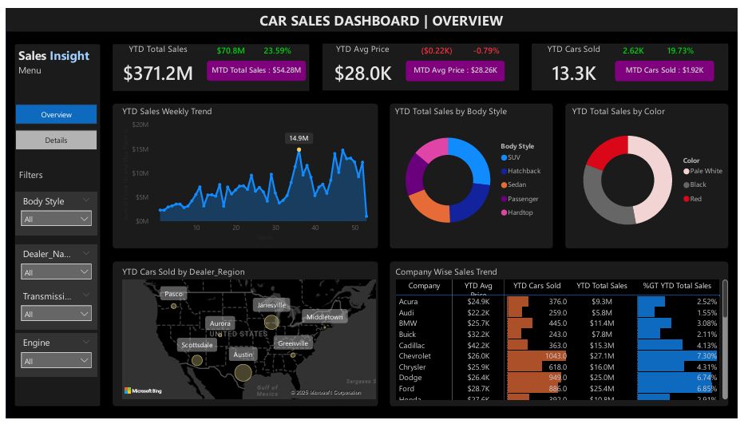

# 🚗 Car Sales Analysis – Power BI

## *Project Objective*
This project analyzes car sales to understand sales trends, top-selling models, and customer preferences.  
The aim is to get a clear idea of which cars perform well and how sales change over time.

---

## *Process*
- Loaded data into Power BI  
- Cleaned and formatted the data  
- Created KPIs for total sales and revenue  
- Built charts for fuel type, transmission, monthly trends, and model performance  
- Designed an interactive dashboard with slicers  

---

## *Questions Answered*
- How many cars were sold in total?  
- What is the total selling price?  
- Which fuel type sells the most?  
- Do customers prefer manual or automatic?  
- Which car models are the top sellers?  
- Which brands perform best?  
- How do sales change month by month?  

---

## *Dashboard*
- (dashboard2.png)
[Download Dashboard PDF](.car-sales-dashboard.pdf)
[Download PBIX File](.car-sales-dashboard-analysis.pbix)

---

## *Conclusion*
The dashboard shows selling patterns clearly.  
It helps identify top brands, popular fuel types, and which models bring the highest sales.  
This supports better decision-making and sales planning.

---

## *Future Implementation*
- Add forecasting  
- Add drill-through for car model details
